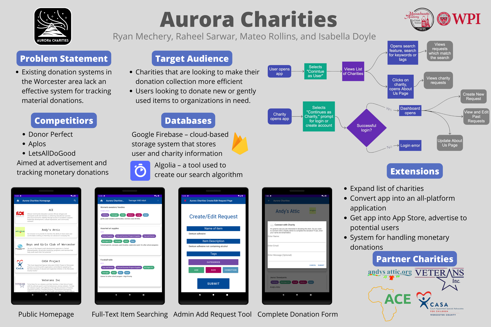
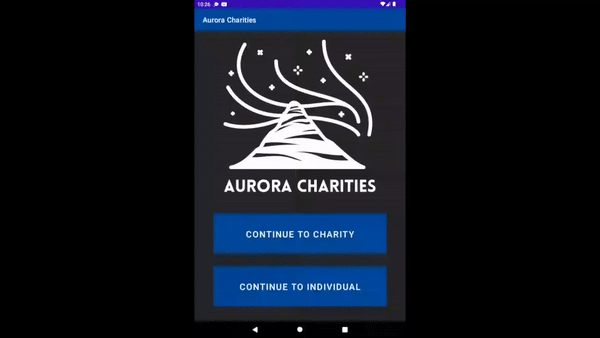

# Background
Aurora Charities is an app developed by Isabella Doyle, Ryan Mechery, Mateo Rollins, and Raheel Sarwaar, in conjunction with Andy's Attic, Veterans Inc., ACE, and CASA. The app was developed to simplify the donation process between charities and end users. Code was developed with Android Studio on the frontend and Firebase on the backend. The app primarily allows charities to easily and efficiently list must-need items that end users can publicly see and donate to. The app was presented at the Massachusetts Academy of Math and Sciences Apps for Good Fair in 2022.

# Poster

# Demo

